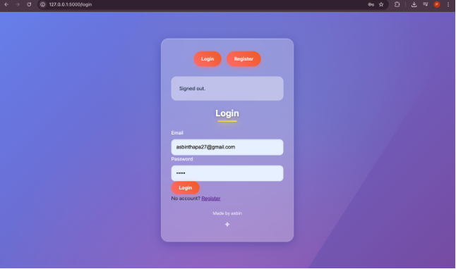
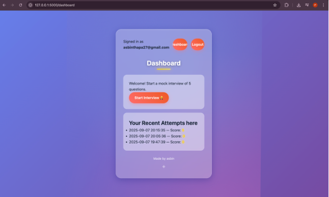
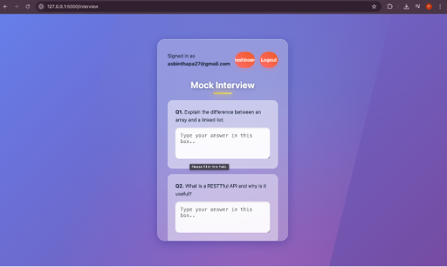

<div align="center">

# 🤖 AI Mock Interview Bot


**A web-based mock interview practice platform with automated feedback**

[](https://www.python.org/)
[](https://flask.palletsprojects.com/)
[](https://www.sqlite.org/)
[]()

[Features](#-features) • [Screenshots](#-screenshots) • [Installation](#-installation) • [Usage](#-usage) • [Project Structure](#-project-structure)

</div>

---

## 📖 Overview

AI Mock Interview Bot is a lightweight web application designed to help users practice job interviews through text-based interactions. It provides preset interview questions, collects user responses, and delivers rule-based feedback to improve interview performance.

### 🎯 Perfect For
- 📚 Students preparing for job interviews
- 💼 Job seekers wanting to practice
- 🎓 Career development training
- 🔄 Quick interview rehearsal sessions

---

## ✨ What It Has

<table>
<tr>
<td width="50%">

### ✅ Core Features
- 🔐 **User Authentication**
  - Register new accounts
  - Login with SQLite backend
  - Session management
  
- 📝 **Mock Interview System**
  - 5 preset interview questions
  - Text-based answer input
  - Clean, user-friendly interface

</td>
<td width="50%">

### ✅ Feedback System
- 🎯 **Rule-Based Analysis**
  - Keyword matching
  - Static feedback tips
  - Performance scoring
  
- 📊 **Results Display**
  - Score calculation
  - Detailed result page
  - Answer review

</td>
</tr>
</table>

---

## ❌ What It Does NOT Have

<table>
<tr>
<td width="33%">

### 🚫 AI Features
- No real AI models
- No OpenAI/GPT integration
- No machine learning
- No natural language processing

</td>
<td width="33%">

### 🚫 Advanced Features
- No voice interaction
- No speech recognition
- No external APIs
- No advanced analytics

</td>
<td width="33%">

### 🚫 Complex Systems
- No video recording
- No real-time analysis
- No adaptive questions
- No cloud integration

</td>
</tr>
</table>

> **Note:** This is a lightweight, educational project focusing on core web development concepts with Python Flask and SQLite.

---

## 📸 Screenshots

<div align="center">

### Login Interface


### Interview Dashboard


### Results Page


</div>

---

## 🛠️ Tech Stack

<div align="center">

### Backend Technologies


### Frontend Technologies


</div>

---

## 📁 Project Structure

```
ai-project/
│
├── 📂 static/                   # Static assets
│   └── style.css                # Main stylesheet
│
├── 📂 templates/                # HTML templates (Jinja2)
│   ├── layout.html              # Base template
│   ├── login.html               # Login page
│   ├── register.html            # Registration page
│   ├── dashboard.html           # User dashboard
│   ├── interview.html           # Interview session page
│   └── result.html              # Results display page
│
├── 📄 app.py                    # Main Flask application
├── 📄 init_db.py                # Database initialization script
├── 📄 app.db                    # SQLite database (created on init)
├── 📄 questions.json            # Interview questions database
├── 📄 requirements.txt          # Python dependencies
├── 📄 report_template.txt       # Feedback report template
├── 📄 image.png                 # Screenshot 1
├── 📄 image-1.png               # Screenshot 2
├── 📄 image-2.png               # Screenshot 3
└── 📄 README.md                 # Project documentation
```

---

## 🚀 Quickstart Process

### Prerequisites

```bash
# Ensure Python 3.8+ is installed
python --version

# pip should be available
pip --version
```

### Installation Steps

```bash
# 1) Clone the repository
git clone https://github.com/asbinthapa99/ai-project.git
cd ai-project

# 2) Create virtual environment (recommended)
python -m venv .venv

# 3) Activate virtual environment
# On Windows:
.venv\Scripts\activate

# On macOS/Linux:
source .venv/bin/activate

# 4) Install dependencies
pip install -r requirements.txt

# 5) Initialize the database
python init_db.py

# 6) Run the application
python app.py
```

### Access the Application

Open your browser and navigate to:
```
http://127.0.0.1:5000
```

---

## 💻 Usage Guide

### 1️⃣ Registration
- Navigate to the registration page
- Create a new account with username and password
- Credentials are stored securely in SQLite database

### 2️⃣ Login
- Use your credentials to log in
- Session is maintained throughout your usage

### 3️⃣ Start Interview
- Click "Start Mock Interview" from dashboard
- System loads 5 preset questions from `questions.json`

### 4️⃣ Answer Questions
- Type your responses in the text areas provided
- No time limit - take your time to craft answers
- All answers are text-based (no voice input)

### 5️⃣ Submit & Get Feedback
- Submit your answers when complete
- System analyzes responses using keyword matching
- Receive rule-based feedback and tips

### 6️⃣ View Results
- Check your performance score
- Review feedback for each answer
- See areas for improvement

---

## 📊 How It Works

### Question System

```json
{
  "questions": [
    {
      "id": 1,
      "text": "Tell me about yourself",
      "keywords": ["experience", "background", "skills"]
    }
  ]
}
```

### Feedback Mechanism

```python
# Rule-based feedback logic
def analyze_answer(answer, keywords):
    score = 0
    feedback = []
    
    # Check for keywords
    for keyword in keywords:
        if keyword.lower() in answer.lower():
            score += 20
            feedback.append(f"Good use of '{keyword}'")
    
    # Provide tips
    if score < 60:
        feedback.append("Try to be more specific")
    
    return score, feedback
```

### Scoring System

- **Keyword Match**: 20 points per keyword found
- **Answer Length**: Bonus for comprehensive answers
- **Total Score**: Out of 100
- **Grade**: A (90+), B (75-89), C (60-74), D (<60)

---

## 🔧 Configuration

### requirements.txt
```txt
Flask==2.3.0
Flask-SQLAlchemy==3.0.0
Werkzeug==2.3.0
```

### Database Schema

```sql
CREATE TABLE users (
    id INTEGER PRIMARY KEY AUTOINCREMENT,
    username TEXT UNIQUE NOT NULL,
    password_hash TEXT NOT NULL,
    created_at TIMESTAMP DEFAULT CURRENT_TIMESTAMP
);

CREATE TABLE interview_sessions (
    id INTEGER PRIMARY KEY AUTOINCREMENT,
    user_id INTEGER,
    score INTEGER,
    completed_at TIMESTAMP,
    FOREIGN KEY (user_id) REFERENCES users(id)
);
```

---

## 🎯 Key Features Explained

### 1. User Authentication
- **Secure password hashing** using Werkzeug
- **Session management** with Flask sessions
- **SQLite storage** for user credentials

### 2. Interview Questions
- **Static question bank** loaded from JSON
- **Predetermined set** of 5 questions
- **Consistent experience** for all users

### 3. Feedback System
- **Keyword-based analysis** for quick evaluation
- **Static tips** based on common interview best practices
- **Simple scoring** for easy understanding

### 4. Results Tracking
- **Score calculation** based on keyword presence
- **Feedback display** with actionable suggestions
- **Session history** (basic implementation)

---

## 🎓 Educational Value

This project is excellent for learning:

- ✅ **Flask Web Framework** - Routes, templates, sessions
- ✅ **SQLite Database** - CRUD operations, queries
- ✅ **User Authentication** - Hashing, sessions, security
- ✅ **HTML/CSS** - Frontend design, forms
- ✅ **JSON Handling** - Data parsing, storage
- ✅ **Python Best Practices** - Code organization, structure

---

## 🔮 Future Enhancement Ideas

Want to expand this project? Consider adding:

- 🤖 Real AI integration (OpenAI API)
- 🎤 Speech recognition for voice answers
- 📊 Advanced analytics dashboard
- 📈 Progress tracking over time
- 🎯 Personalized question generation
- 📱 Mobile-responsive design improvements
- 👥 Multiple interview categories
- 📧 Email results functionality
- 🔄 Question randomization
- 💾 Export results as PDF

---

## 🐛 Troubleshooting

### Common Issues

**Problem**: Database not found
```bash
# Solution: Re-initialize the database
python init_db.py
```

**Problem**: Port already in use
```bash
# Solution: Change port in app.py or kill existing process
# In app.py, change:
app.run(debug=True, port=5001)  # Use different port
```

**Problem**: Module not found
```bash
# Solution: Ensure virtual environment is activated
source .venv/bin/activate  # or .venv\Scripts\activate on Windows
pip install -r requirements.txt
```

---

## 👨‍💻 Developer

<div align="center">

**Developed by Asbin Thapa**

[](https://asbinthapa.info.np/)
[](https://github.com/asbinthapa99)
[](mailto:asbinthapa27@gmail.com)

</div>

---

## 📄 License

```
MIT License

Copyright (c) 2025 Asbin Thapa

Permission is hereby granted, free of charge, to any person obtaining a copy
of this software and associated documentation files (the "Software"), to deal
in the Software without restriction, including without limitation the rights
to use, copy, modify, merge, publish, distribute, sublicense, and/or sell
copies of the Software, and to permit persons to whom the Software is
furnished to do so.

THE SOFTWARE IS PROVIDED "AS IS", WITHOUT WARRANTY OF ANY KIND.
```

---

## 🙏 Acknowledgments

- Flask framework documentation
- SQLite database engine
- Python community resources
- Open source contributors

---

## 📞 Support & Contact

Have questions or suggestions? Feel free to:

- 📧 **Email**: asbinthapa27@gmail.com
- 🌐 **Website**: [asbinthapa.info.np](https://asbinthapa.info.np/)
- 💼 **LinkedIn**: [Asbin Thapa](https://www.linkedin.com/in/asbin-thapa-6a9a4733b/)
- 🐙 **GitHub**: [@asbinthapa99](https://github.com/asbinthapa99)

---

<div align="center">

**⭐ Star this repository if you found it helpful!**


**Made with ❤️ by Asbin Thapa**

</div>
